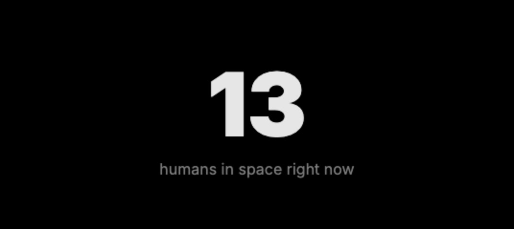
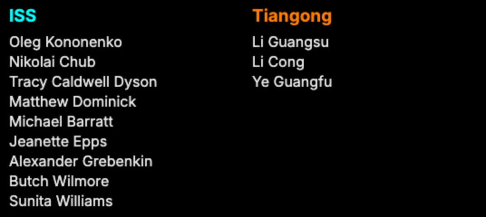
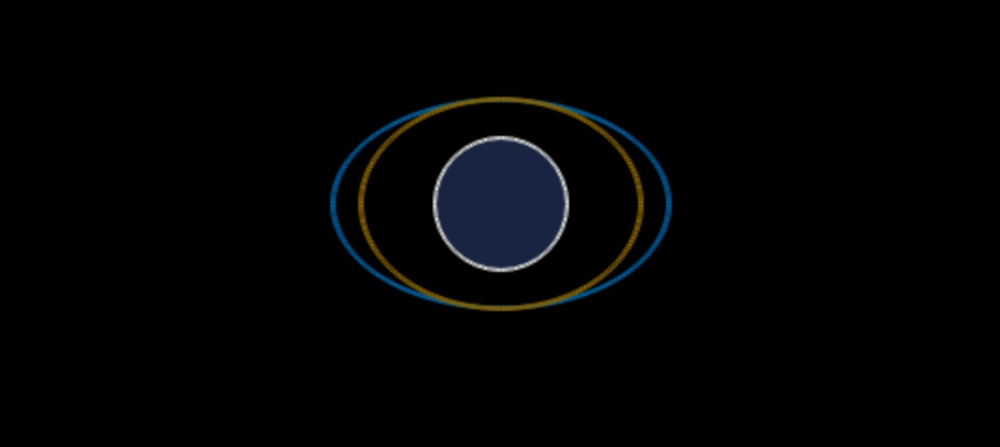
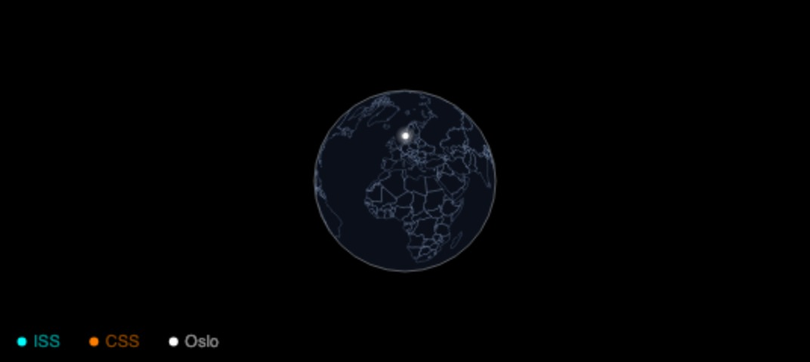
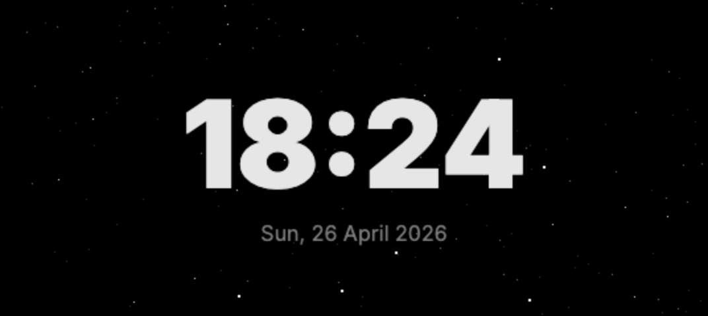
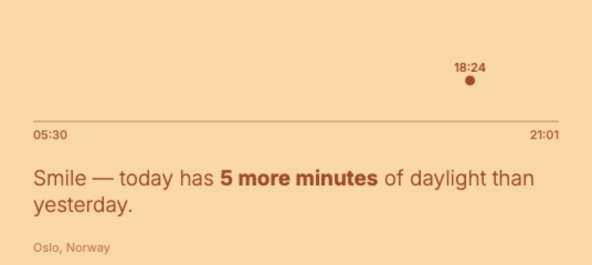
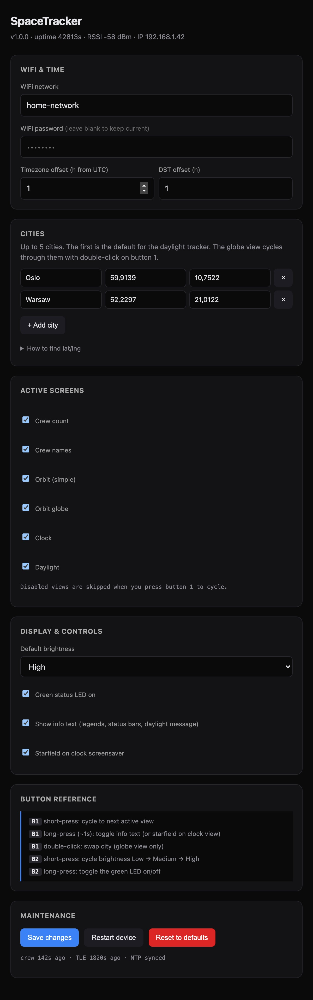

# SpaceTracker

> A tiny AMOLED desk companion that shows you who's in space, where the ISS is right now, what time the sun rises, and a few other things — all on a 1.91" screen the size of a USB stick.


Built on the **LilyGo T-Display S3 AMOLED** (the cute USB-stick form factor with a beautiful 240×536 screen). Six selectable views, two buttons, no apps, no accounts. Configure everything from a small built-in web portal — no re-flashing for routine changes.

---

## Table of contents

- [What it does](#what-it-does)
- [Hardware](#hardware-youll-need)
- [Quick start](#quick-start)
- [The six screens](#the-six-screens)
- [Buttons & controls](#buttons--controls)
- [Web config portal](#web-config-portal)
- [Customisation recipes](#customisation-recipes)
- [How it works (architecture)](#how-it-works)
- [Troubleshooting](#troubleshooting)
- [Building from source](#building-from-source)
- [Project layout](#project-layout)
- [Credits](#credits)
- [License](#license)
- [Contributing](#contributing)

---

## What it does

Six screens, cycle with one button:

1. **Crew count** — big number: how many humans are in space right now
2. **Crew names** — grouped by spacecraft (ISS, Tiangong, …)
3. **Orbit (simple)** — Earth at the centre, two tilted orbit ellipses, satellite dots
4. **Orbit globe** — same Earth but with country outlines and a city of your choice marked, plus comet-trail orbits
5. **Clock screensaver** — big 24h time + date, optional starfield
6. **Daylight tracker** — sun arc with sunrise/sunset times, narrative message ("3 more minutes of daylight today!"), phase-tinted background that warms and cools through the day

All data is real (live or recently cached): SGP4 orbital propagation for the satellites, Open Notify for who's aboard, your local sunrise/sunset computed on-device with a port of suncalc.js, country outlines from Natural Earth.

The device hosts a small web config portal so you can change cities, disable views you don't want, set brightness, etc., from any phone or laptop on the same WiFi — without re-flashing.

---

## Hardware you'll need

- **[LilyGo T-Display S3 AMOLED](https://lilygo.cc/products/t-display-s3-amoled)** — get the **non-touch** variant. The touch model may behave slightly differently around GPIO 38 (the LED pin).
- **A USB-C cable** for power + flashing.

That's it. Optional: a 3D-printed stand or a tiny acrylic case. The board has two physical buttons built in (GPIO 0 and GPIO 21) — those are the only inputs you need.

---

## Quick start

For someone with zero ESP32 / Arduino experience.

### 1. Install PlatformIO

PlatformIO is a free build tool for embedded projects. Easiest path: install [VS Code](https://code.visualstudio.com/) then add the [PlatformIO IDE extension](https://platformio.org/install/ide?install=vscode). Or use the [CLI](https://docs.platformio.org/en/latest/core/installation/index.html) directly.

### 2. Get the code

```bash
git clone https://github.com/Laboratoriet/SpaceTracker.git
cd SpaceTracker
```

### 3. Build

```bash
pio run
```

PlatformIO will download all the libraries (OneButton, ArduinoJson, Sgp4, U8g2) the first time. This takes a minute. Subsequent builds take ~10 seconds.

### 4. Flash

Plug in the LilyGo board over USB-C, then:

```bash
python3 -m esptool --chip esp32s3 --port /dev/cu.usbmodem* --no-stub \
  write_flash \
    0x0     .pio/build/lilygo-t-display-s3/bootloader.bin \
    0x8000  .pio/build/lilygo-t-display-s3/partitions.bin \
    0x10000 .pio/build/lilygo-t-display-s3/firmware.bin
```

(On Windows, replace `/dev/cu.usbmodem*` with the COM port you see in Device Manager, e.g. `COM5`.)

If `esptool` says "Can't find chip", hold the **boot button** (B1, the one closer to the USB-C port) while plugging in the USB cable.

After flashing, **unplug and replug** the USB cable to power-cycle. The screen should light up and show "SPACE TRACKER".

### 5. Configure WiFi

On first boot, the device creates its own WiFi network called `SpaceTracker-XXXX` (where `XXXX` is the last four characters of its MAC address). The screen will tell you what it's called.

1. On your phone, join `SpaceTracker-XXXX`. It's an open network — no password.
2. Your phone should pop up a captive portal automatically. If not, open a browser and go to `http://192.168.4.1`.
3. Pick your home WiFi from the list, type the password, choose your timezone, hit **Save**.
4. The device reboots and joins your home WiFi. Once connected, the splash screen shows the local IP for a few seconds.

That's it. Everything else (cities, screens, brightness) can be changed in the web portal — see below.

---

## The six screens

Press **B1** (button 1, closer to the USB-C port) to cycle through the views.

### 1. Crew count



The big number is how many humans are currently in space. Subtitle ("humans in space right now") can be hidden via long-press B1 if you prefer minimal.

### 2. Crew names



Names of every astronaut, grouped by spacecraft (ISS in cyan, Tiangong in amber). Pulled live from [Open Notify](http://open-notify.org/Open-Notify-API/People-In-Space/).

### 3. Orbit (simple)



Earth at the centre, ISS and Tiangong on their tilted orbital ellipses (51.6° and 41.5° inclination respectively). Satellite dots move with real time. Status bar at the bottom shows current lat/lng/altitude for each.

### 4. Orbit globe



A more visual version: country outlines projected onto an Earth disc, your city of choice marked with a bright white dot, and the satellites trail comet-style as they orbit. **Double-click B1** here to swap between cities you've added in the portal.

### 5. Clock screensaver



Big 24h time, date subtitle, optional starfield background (toggle with long-press B1 while on this view).

### 6. Daylight tracker



Inspired by [bakkenbaeck/daylight-ios](https://github.com/bakkenbaeck/daylight-ios). The sun moves along an invisible arc — short and flat in winter, tall and soaring in summer. Background colour smoothly evolves through the day (warm cream at midday, peach at sunset, deep navy at night). The narrative message ("3 more minutes of daylight today!") changes daily based on how today compares to yesterday.

---

## Buttons & controls

| Action                           | Effect                                                                     |
|---                               |---                                                                         |
| **B1** short-press               | Cycle to next active view                                                  |
| **B1** long-press (~1s)          | Toggle info text (legends, status bars, daylight message). On the clock view, toggles the starfield instead. |
| **B1** double-click              | Swap city (only on the globe view)                                         |
| **B2** short-press               | Cycle brightness Low → Medium → High                                       |
| **B2** long-press                | Toggle the green status LED on/off                                         |

All toggles **persist across reboots** — the device remembers what you chose.

---

## Web config portal

Once the device is connected to your WiFi, browse to `http://spacetracker.local/` (or the IP shown on boot) from any device on the same network. You'll see something like this:



### Sections

- **WiFi & Time** — change the WiFi network, set timezone offset and DST.
- **Cities** — add up to 5 cities (name, latitude, longitude). The first one is the default for the daylight tracker. The globe view cycles through them with double-click on B1. The "centre lat / lng" controls how the globe is tilted to keep your city visually prominent — usually `centerLat ≈ city_lat − 30` works well, and the form auto-fills it.
- **Active screens** — checkboxes to enable/disable each view. Disabled views are skipped when you cycle.
- **Display & controls** — default brightness, LED on/off, info-text on/off, starfield on/off.
- **Button reference** — quick reminder of what every button does.
- **Maintenance** — restart, reset to factory defaults (wipes WiFi too — returns to captive portal).

Most settings apply **live** — you'll see the change on the device while you're on the page. WiFi/timezone changes trigger a quick automatic restart.

### Finding the device IP

- On boot, the splash briefly shows it: `192.168.x.x · spacetracker.local`
- mDNS hostname: `http://spacetracker.local/` (works on macOS, iOS, Linux with avahi, Windows with Bonjour)
- Status overlay: long-press both buttons together (planned for v1.1)

---

## Customisation recipes

### Add a custom city

In the web portal → "Cities" → **+ Add city** → type a name (max 15 chars), latitude, longitude. Hit **Save changes**. Done — the new city is now selectable on the globe view (double-click B1) and will appear on the daylight tracker if you make it the first in the list.

To find lat/lng: right-click any spot in [Google Maps](https://maps.google.com/), the coordinates show at the top of the menu.

### Disable views you don't use

In the portal → "Active screens" → uncheck. Disabled views are skipped when you press B1. (You need at least one view enabled, otherwise nothing to cycle to.)

### Change the brightness levels

Currently the cycle is hardcoded to Low=80 / Mid=180 / High=255. To change the values themselves, edit `src/config.h` and re-flash:

```c
#define BRIGHTNESS_LOW   60
#define BRIGHTNESS_MID   160
#define BRIGHTNESS_HIGH  240
```

### Update the hardcoded TLE fallback

The device ships with TLE (orbital element) data baked in so it works offline. Over time those drift (a few km per day for ISS), so refresh once a month or so. Run:

```bash
curl -s "https://tle.ivanstanojevic.me/api/tle/25544"   # ISS
curl -s "https://tle.ivanstanojevic.me/api/tle/48274"   # Tiangong (CSS)
```

Paste the new `line1` / `line2` strings into `src/tle_fallback.h`, re-flash. (When the device's runtime TLE fetch from CelesTrak succeeds, it overwrites the fallback automatically — but if you're permanently offline, this is the way.)

### Regenerate the country coastline data

`src/coastline_data.h` is generated from Natural Earth GeoJSON. To rebuild:

```bash
python3 tools/build_coastline.py
```

This downloads `ne_110m_admin_0_countries.geojson`, packs each ring as `int16_t` lat/lng pairs (×100 for 0.01° precision), and emits the header. About 43 KB of PROGMEM data.

### Generate a custom font

The big crew-count number uses a custom-generated Inter Black 92 px U8g2 font. To regenerate (or make a different size):

```bash
brew install otf2bdf       # macOS
# tools/bdfconv is built-from-source from the u8g2 repo (committed binary)
./tools/build_inter_font.sh
```

Edit `tools/build_inter_font.sh` to change the glyph map (`-m '48-58'` = digits + colon) or font size (`-p 92`).

---

## How it works

For the curious. Skip if you just want to use the device.

### Render pipeline (canvas double-buffering)

Every view renders into a 536×240 RGB565 canvas allocated in PSRAM (~257 KB). Once rendering is done, the entire frame is pushed to the AMOLED in a single QSPI burst. This is the fix for the "screen blinks during redraw" problem — the AMOLED never sees a half-drawn frame.

`src/display.cpp` sets it up; every other view file just calls `gfx->fillCircle/drawLine/setFont/print` against the canvas as if it were the screen.

### State persistence (NVS)

Every user setting lives in a single `State` struct (`src/state.h`) and persists to NVS via the standard ESP32 Preferences library. A `STATE_VERSION` byte invalidates stale state when the schema changes, so an upgrade never loads garbage.

### Suncalc port

`src/suncalc.cpp` is a hand-port of [mourner/suncalc](https://github.com/mourner/suncalc)'s `getTimes()` and `getPosition()`. ~150 lines of pure trigonometry. All numbers in `double` for precision.

### SGP4 (satellite orbital propagation)

`hopperpop/Sgp4` does the SGP4 propagation. We initialise it from the TLE strings (3-line format), then call `findsat(unixTime)` to get current lat/lng/alt. The "comet trail" on the globe view is just `findsat()` called for the past ~92 minutes (one full ISS orbit) at 30 s steps.

### Data sources

| Service       | What                          | URL                                                      | Notes |
|---            |---                            |---                                                       |---    |
| Open Notify   | Who's in space                | `http://api.open-notify.org/astros.json`                 | HTTP only, can be flaky — we cache last-known good |
| CelesTrak     | TLEs (orbital elements)       | `https://celestrak.org/NORAD/elements/gp.php?CATNR=…`    | HTTPS; rate-limited if you hammer them — 6 h refresh |
| Natural Earth | Country outlines for the map  | Public domain GeoJSON                                    | 43 KB PROGMEM at build time |
| pool.ntp.org  | Time sync                     | UDP NTP                                                  | Once at boot |
| Inter font    | Big number / clock typography | [rsms/inter](https://rsms.me/inter/)                     | Bundled glyph subset (digits + colon) |

### Hardware quirks (LilyGo T-Display S3 AMOLED)

- GPIO 38 is the green status LED on the **non-touch** variant. Confirmed via LilyGo's factory firmware. The display has its own power rail — toggling 38 doesn't blank the screen.
- The display brightness is controlled by the AMOLED driver register `0x51`, not PWM. Range 0-255.
- Rotation 1 = landscape 536×240. The board is naturally portrait.
- `WiFiClientSecure` is fragile when reused — always use a fresh client per HTTPS request, or you'll see `start_ssl_client: -1` errors.

See [`docs/troubleshooting.md`](docs/troubleshooting.md) for the full list of gotchas.

---

## Troubleshooting

The full list lives in [`docs/troubleshooting.md`](docs/troubleshooting.md). Common ones:

- **Screen flashes during redraw** — should never happen on the shipping firmware (canvas double-buffering); if it does, your build doesn't have PSRAM enabled.
- **`start_ssl_client: -1`** — TLS handshake failure. Usually means a stale client is being reused; the bundled `api.cpp` already creates a fresh one per request.
- **CelesTrak `403 Forbidden`** — your IP is rate-limited. Wait 2 hours. Don't reduce the TLE refresh interval below 6 h.
- **"Port busy" when flashing** — close your serial monitor (`Ctrl+C` in `pio device monitor`) before running esptool.
- **NEVER write `firmware.bin` to address `0x0`** — overwrites the bootloader.
- **Daylight tracker shows night message during the day** — your timezone is wrong. Set it in the web portal.
- **Captive portal won't load on iOS** — manually browse to `http://192.168.4.1/`.

---

## Building from source

### Setup

1. Install [PlatformIO Core](https://docs.platformio.org/en/latest/core/installation/index.html) (CLI) or the [PlatformIO IDE extension for VS Code](https://platformio.org/install/ide?install=vscode).
2. Clone this repo.
3. `cd SpaceTracker && pio run` — first run downloads dependencies.

### `platformio.ini` walkthrough

```ini
[env:lilygo-t-display-s3]
platform = espressif32
board    = lilygo-t-display-s3
framework = arduino
monitor_speed = 115200
upload_speed  = 115200
build_flags =
    -DBOARD_HAS_PSRAM           ; enables the 8 MB PSRAM (canvas needs it)
    -DARDUINO_USB_CDC_ON_BOOT=1 ; lets us print to Serial via USB
    -I./src
board_build.arduino.memory_type = qio_opi   ; QIO Flash + OPI PSRAM
lib_deps =
    mathertel/OneButton
    bblanchon/ArduinoJson
    hopperpop/Sgp4
    olikraus/U8g2
```

`Preferences`, `WebServer`, `DNSServer`, `ESPmDNS`, `WiFiClientSecure` all come from the ESP32 Arduino core — no extra deps needed.

### Manual flash command

```bash
python3 -m esptool --chip esp32s3 --port /dev/cu.usbmodem* --no-stub \
  write_flash \
    0x0     .pio/build/lilygo-t-display-s3/bootloader.bin \
    0x8000  .pio/build/lilygo-t-display-s3/partitions.bin \
    0x10000 .pio/build/lilygo-t-display-s3/firmware.bin
```

The `--no-stub` flag is **required** for QSPI boot on this board.

---

## Project layout

```
SpaceTracker/
├── platformio.ini
├── README.md, LICENSE, CHANGELOG.md, .gitignore
├── docs/
│   ├── troubleshooting.md
│   └── screenshots/      ← drop your photos here
├── src/
│   ├── main.cpp                     ── setup / loop / button handlers
│   ├── pin_config.h                 ── GPIO assignments
│   ├── config.h                     ── compile-time constants (FW version, brightness levels, etc.)
│   ├── fonts.h, font_inter_black_92.h, coastline_data.h, tle_fallback.h
│   ├── state.h, state.cpp           ── persistent settings (NVS)
│   ├── wifi_setup.h, wifi_setup.cpp ── first-boot captive portal
│   ├── webportal.h, webportal.cpp,
│   │     portal_html.h              ── runtime config UI
│   ├── display.h, display.cpp       ── AMOLED + canvas
│   ├── api.h, api.cpp               ── HTTP / HTTPS data fetchers
│   ├── orbit.h, orbit.cpp           ── SGP4 wrapper
│   ├── suncalc.h, suncalc.cpp       ── sunrise / sunset / sun altitude
│   ├── projection.h, projection.cpp ── orthographic camera
│   ├── view_splash.{h,cpp}          ── boot screen
│   ├── view_crew.{h,cpp}            ── view 1
│   ├── view_names.{h,cpp}           ── view 2
│   ├── view_orbit.{h,cpp}           ── view 3
│   ├── view_globe.{h,cpp}           ── view 4
│   ├── view_clock.{h,cpp}           ── view 5
│   └── view_daylight.{h,cpp}        ── view 6
├── tools/
│   ├── build_coastline.py           ── regenerate coastline_data.h
│   ├── build_inter_font.sh          ── regenerate font_inter_black_92.h
│   └── bdfconv                      ── built from u8g2 source (host binary)
└── preview/
    ├── index.html                   ── browser-based design preview of all views
    └── serve.py                     ── local server + crew/TLE proxy for the preview
```

---

## Credits

Standing on the shoulders of:

- **[Bakken & Bæck](https://github.com/bakkenbaeck/daylight-ios)** for the gorgeous Daylight iOS app design language — the daylight tracker view is a direct homage.
- **[Volodymyr Agafonkin](https://github.com/mourner/suncalc)** for the suncalc.js algorithms.
- **[hopperpop/Sgp4](https://github.com/Hopperpop/Sgp4-Library)** for the SGP4 orbital propagator.
- **[Olivier Gillet (olikraus/U8g2)](https://github.com/olikraus/u8g2)** for the bitmap font system + tooling.
- **[Moon Modules / lewisxhe (Arduino_GFX)](https://github.com/moononournation/Arduino_GFX)** for the AMOLED driver + canvas implementation.
- **[mathertel/OneButton](https://github.com/mathertel/OneButton)** for click/long-press/double-click detection.
- **[bblanchon/ArduinoJson](https://github.com/bblanchon/ArduinoJson)** for parsing API responses.
- **[Natural Earth](https://www.naturalearthdamain.com/)** for the public-domain coastline data.
- **[Open Notify](http://open-notify.org/)** for the "who's in space" API.
- **[CelesTrak](https://celestrak.org/)** for the TLE orbital elements.
- **[rsms/inter](https://rsms.me/inter/)** for the Inter typeface.
- **[LilyGo](https://lilygo.cc/)** for the lovely little hardware.

---

## License

MIT — see [LICENSE](LICENSE). Use it, modify it, ship it. A heads-up if you do something cool with it would make my day.

---

## Contributing

Issues and PRs welcome. If you ship a SpaceTracker on your shelf, please share a photo — I'd love to see it.

For larger changes, open an issue first to chat about the direction. Keep PRs focused (one feature / one fix per PR).

---

*SpaceTracker was originally built as a gift for my partner — the goal was a tiny ambient object that made the space station feel less abstract. Hope it brings a little of that to wherever you put it.*
